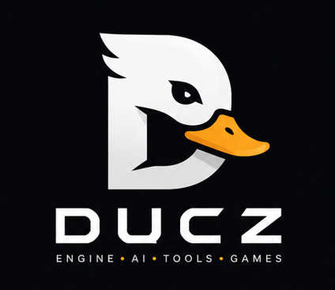
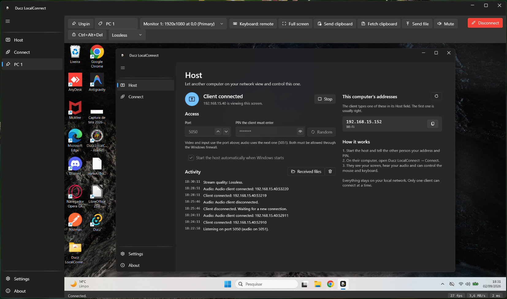
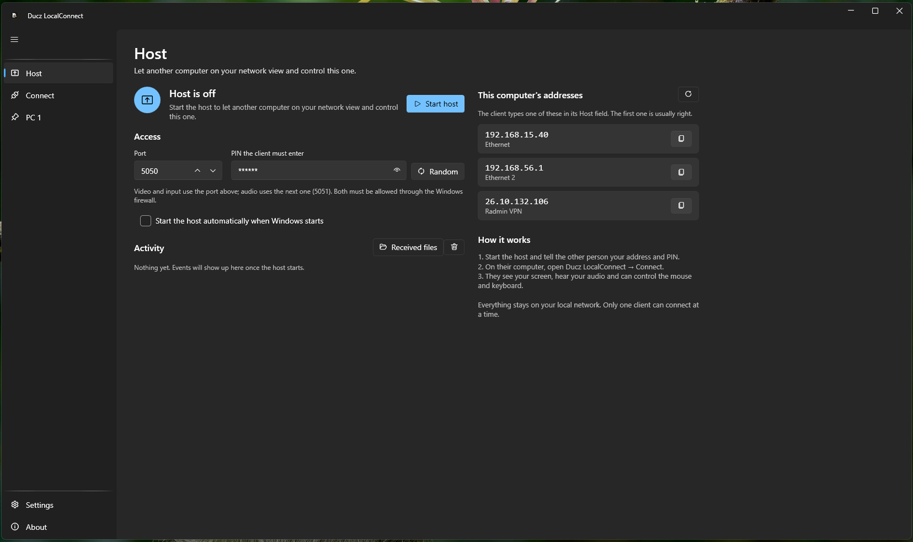
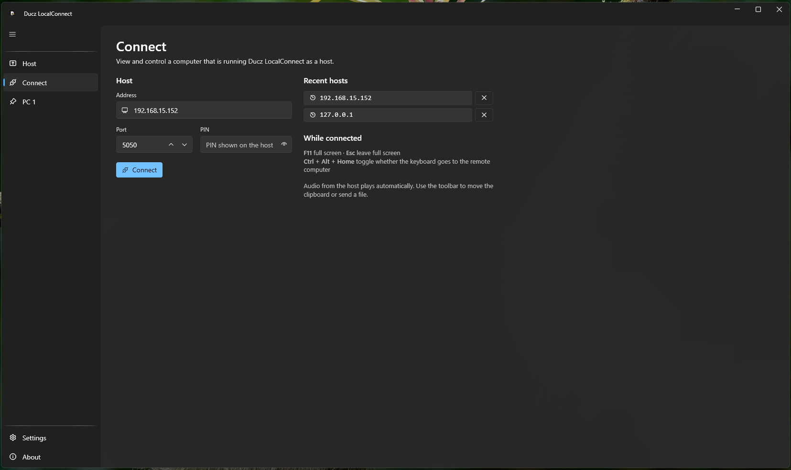

<div align="center">
  
</div>

<h1 align="center">Ducz LocalConnect</h1>

<p align="center">
  Remote desktop for two computers on the same local network.<br>
  Screen, audio, mouse, keyboard, clipboard and files - no account, no cloud, no relay.
</p>

<p align="center">
  <a href="https://github.com/LuanDucate/Ducz.LocalConnect/releases/latest"></a>
  
  
  <a href="LICENSE.txt"></a>
</p>

<p align="center">
  
</p>

## What it does

One computer runs as the **host** and shares its screen; another connects as the **client** and
controls it. Everything travels directly between the two machines over TCP.

- **Screen streaming** with differential frames - a static desktop costs nothing, a cursor move costs a
  tiny patch
- **Multi-monitor**: the client picks which of the host's displays to view
- **Remote mouse and keyboard**, with a toggle (`Ctrl+Alt+Home`) to keep shortcuts like `Alt+Tab` local
- **Full screen that feels local**: the Windows key, `Alt+Tab` and every other shortcut go to the
  remote computer; a control bar slides in from the top edge; a button sends `Ctrl+Alt+Del`
- **Multiple sessions at once** - connect to several computers; each gets its own renameable entry in
  the sidebar. The one you're watching streams; the rest sit paused and muted until you click them,
  then resume instantly. Ideal for hopping between machines on your desk
- **Pin your computers** - keep a connection in the sidebar so it stays one click away to reconnect,
  even after disconnecting. Pin by computer name and it survives the host getting a new IP
- **Start the host with Windows** - optionally launch at login and start hosting (with your PIN),
  minimized to the notification area
- **Quality presets** - *Sharp* keeps text pixel-perfect on a wired LAN, *Balanced* suits Wi-Fi
- **System audio** from the host, on a dedicated channel so it never waits behind a video frame
- **Clipboard** in both directions and **file transfer** to the host, on demand
- **PIN** before anything is shown, one client at a time, liveness checks that notice a dead peer in
  seconds, notifications when a client connects or leaves
- Fluent, Windows 11-style UI with light and dark themes; minimizes to the notification area

<table>
  <tr>
    <td></td>
    <td></td>
  </tr>
  <tr>
    <td align="center"><b>Host</b> - share this PC, with a PIN and start-with-Windows</td>
    <td align="center"><b>Connect</b> - reach another PC on the LAN</td>
  </tr>
</table>

## Quick start

Download `DuczLocalConnect-Setup-x.y.z.exe` from the
[latest release](https://github.com/LuanDucate/Ducz.LocalConnect/releases/latest) and install it on
both computers. No .NET runtime needed.

**On the computer you want to control (host)**

1. Open the **Host** page. Keep the default port `5050` or pick another.
2. Note the **PIN** (or generate a new one) and click **Start host**.
3. Tell the other person one of the addresses listed and the PIN.

**On the computer you are sitting at (client)**

1. Open the **Connect** page, enter the host's address, port and PIN, click **Connect**.
2. You are now looking at the remote screen. Click it to start controlling.
3. Use the toolbar to switch monitors, go full screen, move the clipboard, send a file or mute audio.

The first time the host starts, Windows asks to allow the app through the firewall - say yes for
private networks. See [troubleshooting](docs/troubleshooting.md) if the client can't connect.

## How it works

```
   host                                                    client
   ┌──────────────┐  JPEG full/delta frames  ┌──────────────────┐
   │ GDI capture  │ ───────────────────────▶ │ WriteableBitmap  │
   │ diff encoder │ ◀─────────────────────── │ mouse / keyboard │  TCP :port
   │ SendInput    │  input, clipboard, files │ clipboard, files │
   ├──────────────┤                          ├──────────────────┤
   │ WASAPI       │ ───────────────────────▶ │ WaveOut          │  TCP :port+1
   │ loopback     │       PCM chunks         │                  │
   └──────────────┘                          └──────────────────┘
```

- A small **binary protocol** with a magic + version handshake and hard size limits on every field, so
  a bad peer can't make the app allocate arbitrary memory - [docs/protocol.md](docs/protocol.md)
- The capture loop **blocks on each send**: that single choice is the flow control. A slow link lowers
  the frame rate instead of growing a queue
- The audio engine's callback thread only ever copies bytes into a bounded channel; a separate task
  talks to the network. (This is what used to freeze the host in v1)
- Frames are decoded on the network thread and blitted into one long-lived bitmap on the UI thread

Read more in [docs/architecture.md](docs/architecture.md).

## Building from source

Requirements: Windows 10/11, [.NET 10 SDK](https://dotnet.microsoft.com/download/dotnet/10.0).

```powershell
git clone https://github.com/LuanDucate/Ducz.LocalConnect.git
cd Ducz.LocalConnect
dotnet build Ducz.LocalConnect.slnx
dotnet test
dotnet run --project src\Ducz.LocalConnect.App
```

To build the installer you also need [Inno Setup 6](https://jrsoftware.org/isinfo.php):

```powershell
.\scripts\build-installer.ps1 -Version 1.0.1
```

Warnings are errors, and the CI runs the same build and tests on every push.

## Repository layout

```
src/Ducz.LocalConnect.Core/    protocol, capture, audio, input, clipboard, transfer, sessions (no UI)
src/Ducz.LocalConnect.App/     WPF app: views, view-models, RemoteScreenView, settings
src/Branding/                  logo and icon
tests/                         xUnit tests for the core (protocol round-trips, limits, encoder, handshake)
docs/                          architecture, protocol, releasing, troubleshooting, screenshots
installer/ · scripts/          Inno Setup script and the publish + package script
.github/workflows/             CI (build + test) and release (installer attached to GitHub releases)
```

## Security

This is a **trusted-LAN** tool: the PIN gates the session, but the stream is not encrypted and the
client gets the host's privileges. Don't expose the ports to the internet. Details and the roadmap for
TLS are in [docs/architecture.md](docs/architecture.md#security-posture).

## Roadmap

- TLS transport with certificate fingerprint verification
- DXGI Desktop Duplication capture (lower host CPU)
- Host discovery on the LAN
- Bidirectional file transfer, cursor shape streaming

## License

[MIT](LICENSE.txt) © Luan Michel Ducate
